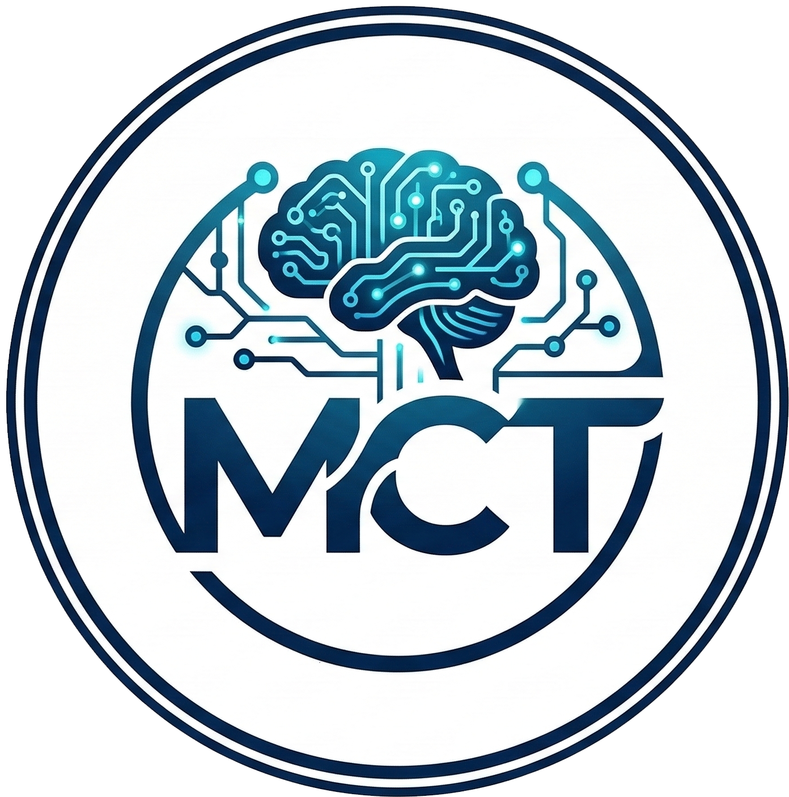

  

  # Pemrosesan Bahasa Alami (NLP)
  **SD25-32202 - Institut Teknologi Sumatera**

  
  
  
  
  

## 📖 Tentang Repositori
Repositori ini berisi materi pembelajaran, *slide* presentasi, dan *source code* praktik untuk mata kuliah **SD25-32202 Pemrosesan Bahasa Alami**. Repositori ini berfungsi sebagai panduan dan wadah eksplorasi bagi mahasiswa untuk memahami serta mempraktikkan langsung tahapan *pipeline* NLP, mulai dari tahap pendekatan *Machine Learning* tradisional hingga penerapan arsitektur *Deep Learning*.

---

## 📅 Sesi Workshop & Jadwal Perkuliahan

| Pertemuan Kuliah | Sesi Workshop | Topik Topik Pembelajaran | Materi Slide | *Source Code* | Kredit Dataset |
|:----:|:----:|:---:|:---:|:---:|:---|
| **Pertemuan 6 & 7** | **Sesi 1** | **NLP with Machine Learning** | [Slide Sesi 1](slides/sesi1_slide.pdf) | [`module_ML`](module_ML) | [Indonesian Chat Dataset (Kaggle)](https://www.kaggle.com/datasets/jprestiliano/indonesian-chat-dataset) |
| **Pertemuan 9 & 10** | **Sesi 2** | **NLP with Deep Learning** | *TBA* | *TBA* | *TBA* |

---

> ⚠️ **DISCLAIMER: Peringatan Konten SARA & Eksplisit (Studi Kasus Sesi 1)**
> 
> Studi kasus pada pembelajaran Sesi 1 menggunakan data obrolan interaksi nyata pengguna gim daring (*online game*). Oleh karena itu, dataset yang digunakan mungkin akan memuat kata-kata **SARA, slang, kata-kata rasis**, dan bahasa yang **tidak pantas**.
> 
> *Materi ini murni didistribusikan dan digunakan untuk tujuan edukasi serta penelitian di bidang pemrosesan bahasa alami.*

---

## 📜 Kontrak Kuliah
Mahasiswa yang mengikuti perkuliahan dan workshop ini tunduk pada aturan **Kontrak Kuliah** yang disepakati bersama. Aturan selengkapnya dapat diakses pada halaman interaktif berikut:
> 🔗 **[mctm.web.id/rules](https://mctm.web.id/rules)**

Secara garis besar, beberapa aturan utama meliputi:
*   **Keterlambatan**: Segala bentuk keterlambatan pengumpulan tugas tidak mendapat toleransi dan berakibat penalti 10% per jam keterlambatan.
*   **Susulan**: Ujian atau tugas susulan tidak diberikan kecuali pada insiden mendesak khusus seperti duka keluarga, bencana alam, kecelakaan, sakit opname, atau partisipasi perlombaan yang semuanya *wajib dibuktikan secara tertulis* dengan menghubungi dosen sebelum tenggat waktu.

---

## 👨‍🏫 Instruktur & Kredit
Dikembangkan dan disusun oleh:  
**Martin Manullang**  
🌐 Kunjungi *website*: [mctm.web.id](https://mctm.web.id)
